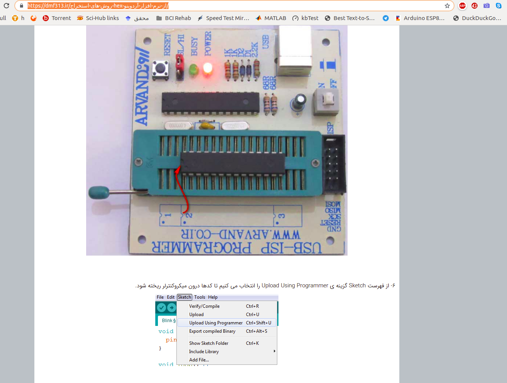

# Arduino-base 2

These codes contain temp  mlx... which is inactive and have the LCD corrupting problem after a third loop of usage

The program could be written on Atmega32A by stk500 programmer by using this method:

‌ِBy using this instructions:

* [Arduino and Atmega32 by STK500 Programer](https://dmf313.ir/%D8%B1%D9%88%D8%B4-%D9%87%D8%A7%DB%8C-%D8%A7%D8%B3%D8%AA%D8%AE%D8%B1%D8%A7%D8%AC-hex-%D8%A7%D8%B2-%D9%86%D8%B1%D9%85-%D8%A7%D9%81%D8%B2%D8%A7%D8%B1-%D8%A2%D8%B1%D8%AF%D9%88%DB%8C%D9%86%D9%88/)

 *
 
And the codes are like this:

 *

**To Do:**

must add **some interrupt for fast exit form Clock loops and fix error of LCD Corrupting situation in clock Loop.**

Thanks to the following people (ordered by name):

* My Mother
* Abrisham Chi
* Saeed
* Dr Assarzadeh
* and ...

